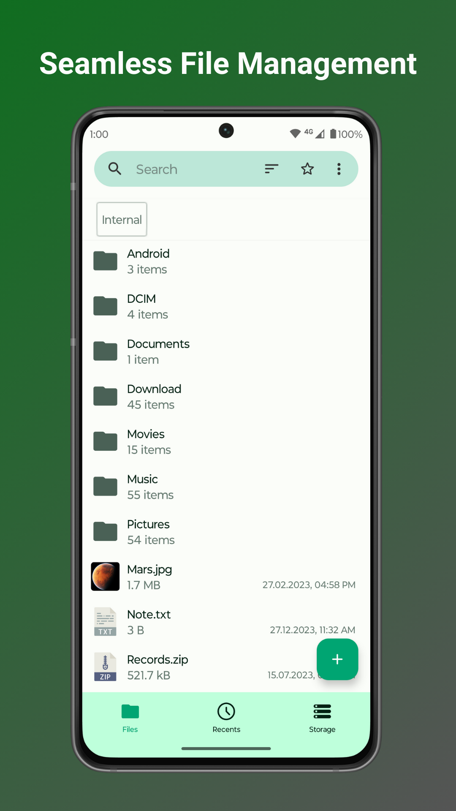
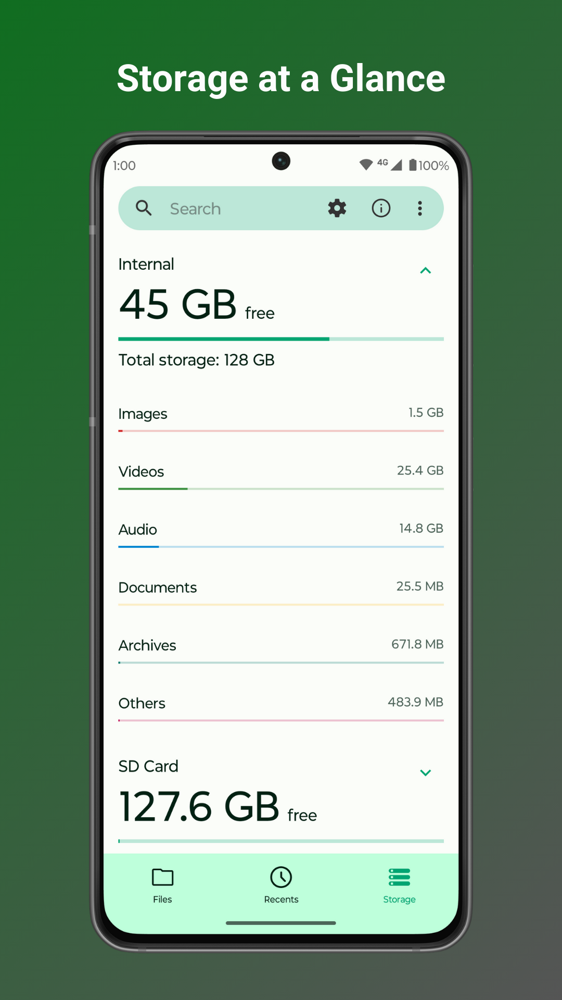
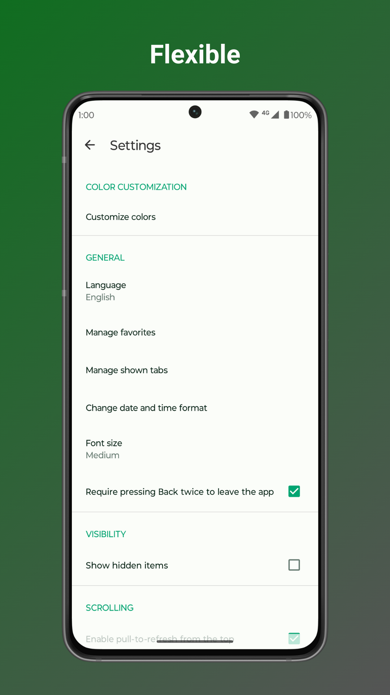

# Fossify File Manager

  

Tired of file managers that slow you down and invade your privacy? Unlock a lightning-fast, secure, and completely customizable experience with Fossify File Manager. ⚡

**🚀 DOMINATE YOUR DIGITAL WORLD WITH BLAZING-FAST NAVIGATION:**
 - Swiftly manage your files with easy compression and transfer capabilities, keeping your digital life organized.
 - Quickly access your most-used folders with customizable home folder and favorite shortcuts.
 - Find what you need in seconds with intuitive navigation, search, and sorting options.

**🔐 FORTIFY YOUR DATA WITH UNPARALLELED PRIVACY AND SECURITY:**
 - Secure sensitive files with password, pattern, or fingerprint locks for hidden items or the entire app.
 - No internet access required – your files stay private and secure on your device.

**💾 MASTER YOUR STORAGE LIKE A PRO:**
 - Clear space with easy file and folder compression to maximize your device's potential.
 - Identify and clean up space-hogging files with the built-in storage analysis tool.
 - Seamlessly navigate root files, SD cards, and USB devices for total organization.

**📁 OPTIMIZE YOUR WORKFLOW WITH HANDY TOOLS:**
 - Create desktop shortcuts for instant access to your most-used files and folders.
 - Edit, print, or read documents easily with the light file editor, enhanced by zoom gestures.

**🌈 MAKE IT YOUR OWN WITH ENDLESS CUSTOMIZATION:**
 - Enjoy an ad-free, open-source experience that puts you in control, not corporate giants.
 - Personalize colors, themes, and icons to reflect your unique style and preferences.

Ditch the bloated, privacy-invading file managers and experience true freedom with Fossify File Manager. Download now and take back control of your digital life!

➡️ Explore more Fossify apps: https://www.fossify.org 
➡️ Open-Source Code: https://www.github.com/FossifyOrg 
➡️ Join the community on Reddit: https://www.reddit.com/r/Fossify 
➡️ Connect on Telegram: https://t.me/Fossify

